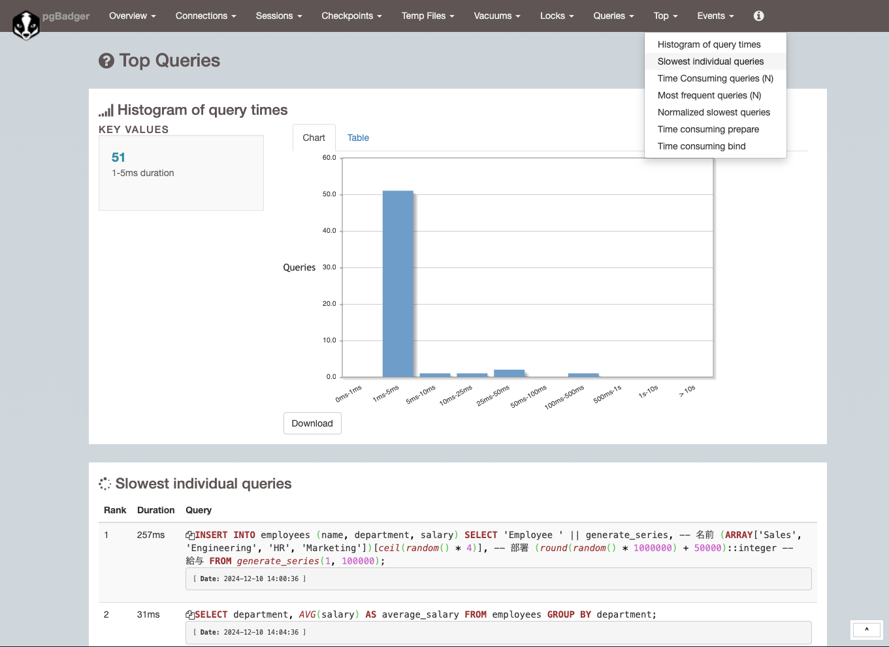

# Postgres

## コンテナの起動
```zsh
docker compose up -d
docker compose down
```
## DB起動確認
[adminerでDB接続確認 Click!](http://localhost:8081/?pgsql=postgres_17_2&username=postgres&db=dev&ns=public)

## スロークエリの発見

参考：https://qiita.com/yk__/items/09bbabd7945f1625c860

### ログファイルが出力されるように設定

```conf
logging_collector = on
```

### ログファイルをpgbadgerで解析

Thanks https://github.com/matsuu/docker-pgbadger

```zsh
mkdir -p ./pgbadger
cat ./postgres-logs/*.log | docker run -i --rm matsuu/pgbadger - -o - -x html > ./pgbadger/out.html
```

出力されたhtmlファイル
Top → Slowest individual queries

